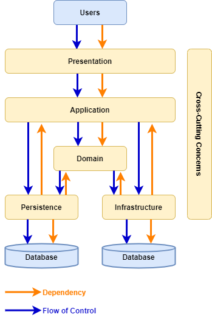
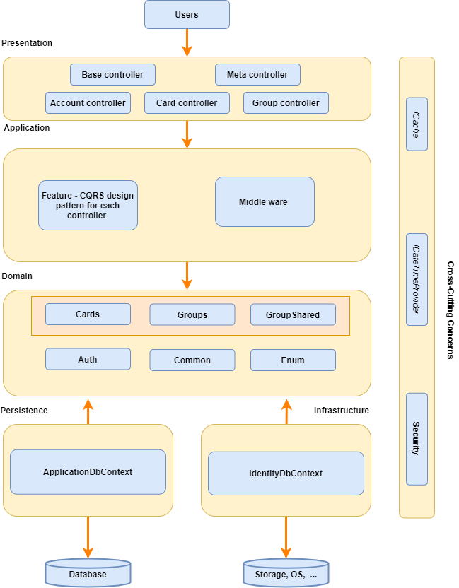
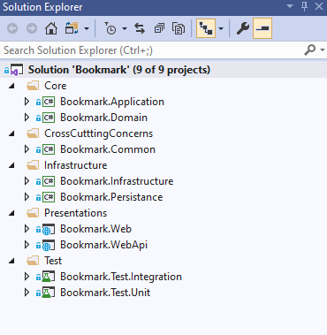
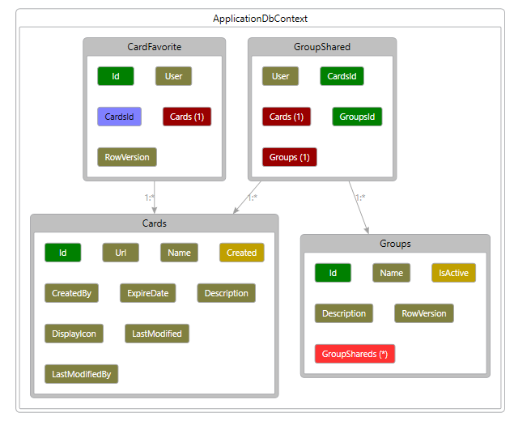
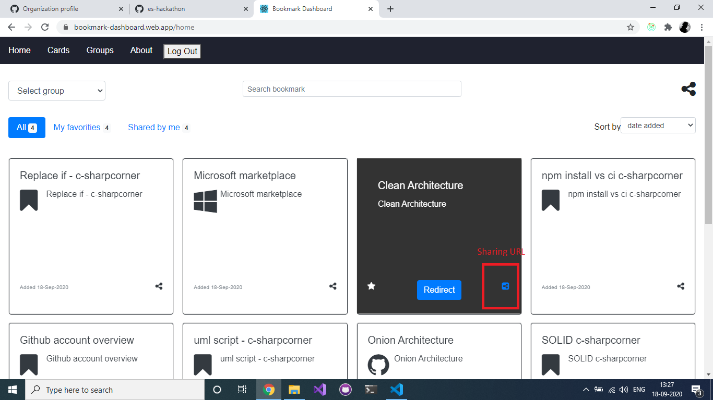
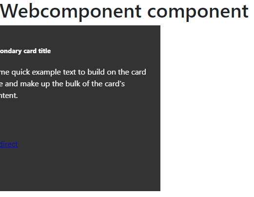
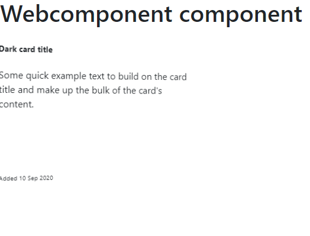
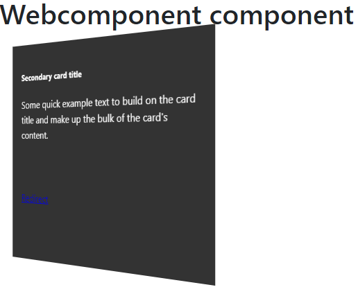
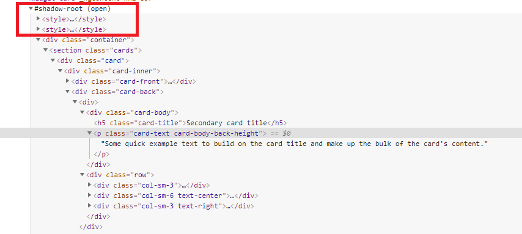

# Bookmark Dashboard

<br />
<p align="center">
  <a href="#">
    
  </a>

  <h3 align="center">Bookmark Dashboard</h3>

  <p align="center">
    Web API solution template which is built on Clean Architecture using .Net Core for bookmark dashboard project!
    <br />
    <a href="https://github.com/es-hackathon/bookmark-dashboard-api"><strong>Explore the docs »</strong></a>
    <br />
    <br />
    <a href="https://github.com/es-hackathon/bookmark-dashboard-api">Download</a>
    ·
    <a href="https://github.com/es-hackathon/bookmark-dashboard-api/issues/new?assignees=&labels=&template=bug_report.md&title=">Report Bug</a>
    ·
    <a href="https://github.com/es-hackathon/bookmark-dashboard-api/issues/new?assignees=&labels=&template=feature_request.md&title=">Request Feature</a>
  </p>
</p>


<!-- TABLE OF CONTENTS -->
# Table of Contents (Web API)

* Web API
  * [About the Project](#about-the-project)
  * [Layer Dependencies](#Layer-Dependencies)
  * [Layer examples](#Layer-examples)
  * [Features available in this project](#Features-available-in-this-project)
  * [Solution Structure](#Solution-Structure)
  * [DB design](#DB-design)
  * [How to Run](#How-to-Run)
  * [Run or Debug the Solution](#Run-or-Debug-the-Solution)
  * [Application URLs](#Application-URLs)
  * [Technology stack](#Technology-stack)
  * [Licence Used](#Licence-Used)
* UI-React
  * [About the UI Project](#about-the-ui-project)
  * [Getting Started UI](#getting-started-ui)
* Widget
  * [About the Widget Project](#About-the-Widget-Project)
  * [How to Run widget](#How-to-Run-widget)
  * [Getting Started widget](#Getting-Started-widget)
  * [Widget Project description](#Widget-Project-description)

## About the Project

Web API solution template which is built on Clean Architecture using .Net Core for bookmark dashboard project!

## Layer Dependencies



[(open on draw.io)](./img/layer-dependencies.drawio)

## Layer examples



[(open on draw.io)](./img/layer-examples.drawio)

## Solution Structure




## DB design



## How to Run
### Update Configuration

#### Database 
  
- Update Connection Strings:

  | Project  | Configuration File | Configuration Key |
  | -------- | ------------------ | ----------------- |
  | Bookmark.WebApi | appsettings.json | ConnectionStrings:BookmarkConn <br> ConnectionStrings:IdentityConnection |
  | Bookmark.Web | appsettings.json | ConnectionStrings:BookmarkConn |

- Run Migration:
  + Option 1: Using dotnet cli:
    + Install **dotnet-ef** cli:
      ```
      dotnet tool install --global dotnet-ef --version="3.1"
      ```
    + Navigate to [Bookmark.WebApi](https://github.com/es-hackathon/bookmark-dashboard-api/tree/develop/src/Bookmark.WebApi/) and run these commands:
      ```
      dotnet ef migrations add Initial-commit-Application --context ApplicationDbContext -o Migrations/Application
      dotnet ef migrations add Identity-commit --context IdentityContext -o Migrations/Identity
      dotnet ef database update --context ApplicationDbContext 
      dotnet ef database update --context IdentityContext 
      ```
  + Option 2: Using Package Manager Console:
    + Set **Bookmark.WebApi** as StartUp Project
    + Open Package Manager Console, select **Bookmark.WebApi.Persistance** as Default Project
    + Run these commands:
      ```sh
      PM> add-migration Initial-commit-Application -Context ApplicationDbContext -o Migrations/Application
      
      PM> update-database -Context ApplicationDbContext 
      ```
    + Open Package Manager Console, select **Bookmark.WebApi.Infrastructure** as Default Project
    + Run these commands:
      ```sh
      PM> add-migration Identity-commit -Context IdentityContext -o Migrations/Identity
      PM> update-database -Context IdentityContext 
      ```


## Run or Debug the Solution
- Web MVC Home Page: https://localhost:44329/

- Navigate to Health Checks UI https://localhost:44329/healthchecks-ui#/healthchecks and make sure everything is green.

  

- Web API Page: https://localhost:44396/OpenAPI/index.html

  

## Application URLs:
| Project  | Launch URL |  Server URL |
| -------- | ---------- |  ---------- |  
| API | https://localhost:44396/OpenAPI/index.html | https://bookmarkwebapi20200916112033.azurewebsites.net/OpenAPI/index.html | 
| Health check | https://localhost:44329/healthchecks-ui#/healthchecks | https://bookmarkweb20200916110752.azurewebsites.net/healthcheck-ui  |
| React UI | http://localhost:3000 | https://bookmark-dashboard.web.app/ |


## Technology stack

Feature with checked is implemented in project, unchecked feature is having some issue 

Architecture Pattern
- [x] Clean architecture
- [x] Screaming architecture-[Functional organisation design](http://blog.cleancoder.com/uncle-bob/2011/09/30/Screaming-Architecture.html)

Design Pattern
- [x] CQRS design pattern
- [x] Repository design pattern and UOW (Already implemented in EF Core, where DbSet acts as Repository and DbContext acts as UOW)
- [x] Mediator design pattern

Features
- [x] Web API
- [x] Entityframework Core - Code First
- [x] Dataseeding
- [x] Custom Exceptionn Handler
- [x] Automapper
- [x] Fluent validation
- [x] Serilog
- [x] Swagger UI
- [x] Healthcheck UI
- [x] InMemory caching
- [x] API Versioning
- [x] User Auditing (default config)
- [x] Enabling CORS
- [ ] Mailkit (Mail service)
- [ ] Miniprofiler

Testing
- [x] Unit testing via NUnit
- [ ] Integration testing via NUnit

Authentication
- [x] OAuth2 (via auth0.org)
- [x] JWT Authentication

UI
- [x] MVC Core
- [x] React-redux
- [x] React widget
- [ ] Kibana


## About the UI Project

Bookmark-Dashboard which help to bookmark URL based on to group in terms of tribes, feature teams, platforms or application

## Getting Started UI

### Step 1:

Clone git repository

### Step 2: Run application

```sha
npm install
npm start

```



### Step 3: Deploy

```sh
npm run build
firebase deploy
```

## About the Widget Project

## How to Run widget

```
// Installing npm packages
$ npm install 

// Build application
$ npm build
```

## Getting Started widget

To add to your application

Step 1:

Add below cdn to your application

```html
<script type="text/javascript" src="<path>/widget-card.js”></script>
```

Step 2:


```html
  <widget-card title="Github" description="GitHub, Inc. is an American multinational corporation that provides 
     hosting for software development and version control using Git. 
     It offers the distributed version control and source code management functionality 
     of Git, plus its own features" 
     url="https://github.com/Amitpnk"
     icon="bookmark"
     date-modified="12 Sep 2020" >
```

## Widget Project description 

### Back view of widget



### Front view of widget



### Flip view of widget



### Shadow dom




## Licence Used
[](https://github.com/es-hackathon/bookmark-dashboard-api/blob/develop/LICENSE)

See the contents of the LICENSE file for details